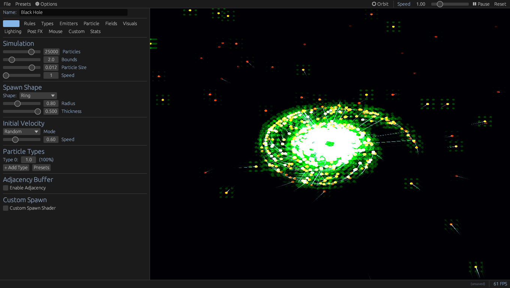

# RDPE

[](https://crates.io/crates/rdpe)
[](https://docs.rs/rdpe)
[](LICENSE)

**GPU-accelerated particle simulations with a visual editor.**

Design particle systems visually, or build them in code. RDPE generates optimized compute shaders either way.

## Visual Editor

The fastest way to create simulations:

```bash
cargo run --release --package rdpe-editor
```



### What You Get

- **Live Preview** — Real-time GPU-accelerated viewport with orbit camera
- **100+ Rules** — Physics, flocking, forces, lifecycle, and custom WGSL
- **21 Presets** — Pre-built simulations to learn from and remix
- **35 Post-Processing Effects** — Bloom, CRT, glitch, thermal, kaleidoscope, and more
- **18 Mouse Powers** — Attract, repel, vortex, paint, black hole, spawn, and more
- **3D Fields** — Spatial fields with volume rendering and vector glyphs
- **Multi-Type Systems** — Particle types with interaction matrices
- **Live Statistics** — Real-time metrics on particle behavior
- **Code Export** — Generate standalone Rust code when you're ready

### Editor Tabs

| Tab | What It Does |
|-----|--------------|
| **Spawn** | Particle count, bounds, spawn shape, velocity, type weights |
| **Rules** | Add and configure simulation rules |
| **Types** | Interaction matrix for multi-type systems |
| **Emitters** | Continuous particle sources |
| **Particle** | Custom per-particle fields |
| **Fields** | 3D spatial fields and volume rendering |
| **Visuals** | Shapes, colors, palettes, trails, connections, wireframes |
| **Post FX** | Stackable post-processing effects |
| **Mouse** | Interactive mouse powers |
| **Custom** | Custom uniforms, shaders, code export |
| **Stats** | Live simulation statistics |

### Controls

| Input | Action |
|-------|--------|
| Left-drag | Orbit camera |
| Scroll | Zoom |
| Middle-drag | Pan camera |
| F11 | Toggle fullscreen |
| Menu bar | Pause, step, speed, reset |

Save your work as JSON, load presets, or export to Rust code.

---

## Code API

For full programmatic control, use the Rust API directly:

```rust
use rdpe::prelude::*;

#[derive(Particle, Clone)]
struct Boid {
    position: Vec3,
    velocity: Vec3,
    #[color]
    color: Vec3,
}

fn main() {
    Simulation::<Boid>::new()
        .with_particle_count(50_000)
        .with_bounds(1.0)
        .with_spatial_config(0.1, 32)
        .with_max_neighbors(48)
        .with_spawner(|ctx| Boid {
            position: random_in_sphere(0.8),
            velocity: random_direction() * 0.3,
            color: Vec3::new(0.2, 0.8, 1.0),
        })
        .with_rule(Rule::Separate { radius: 0.05, strength: 2.0 })
        .with_rule(Rule::Cohere { radius: 0.15, strength: 0.5 })
        .with_rule(Rule::Align { radius: 0.1, strength: 1.0 })
        .with_rule(Rule::SpeedLimit { min: 0.3, max: 1.5 })
        .with_rule(Rule::BounceWalls { restitution: 1.0 })
        .run();
}
```

### Installation

```toml
[dependencies]
rdpe = "0.1"
```

With GUI support (for runtime controls):

```toml
[dependencies]
rdpe = { version = "0.1", features = ["egui"] }
```

### Requirements

- Rust 1.70+
- GPU with Vulkan, Metal, or DX12 support
- Windows, macOS, Linux (including Raspberry Pi)

---

## Features

### 100+ Built-in Rules

**Physics** — `Gravity`, `Drag`, `Acceleration`, `BounceWalls`, `WrapWalls`, `SpeedLimit`, `Mass`

**Point Forces** — `AttractTo`, `RepelFrom`, `PointGravity`, `Spring`, `Radial`, `Shockwave`, `Pulse`, `Arrive`, `Seek`, `Flee`

**Field Effects** — `Vortex`, `Turbulence`, `Orbit`, `Curl`, `Wind`, `Current`, `DensityBuoyancy`, `Diffuse`, `Gradient`

**Flocking** — `Separate`, `Cohere`, `Align`, `Collide`, `Avoid`, `Flock`, `Sync`

**Fluid** — `NBodyGravity`, `Viscosity`, `Pressure`, `SurfaceTension`, `Buoyancy`, `Friction`, `LennardJones`, `DLA`

**Multi-Species** — `Typed`, `Chase`, `Evade`, `Convert`, `Magnetism`, `Absorb`, `Consume`, `Signal`

**Lifecycle** — `Age`, `Lifetime`, `FadeOut`, `ShrinkOut`, `ColorOverLife`, `ColorBySpeed`, `Die`, `Grow`, `Decay`, `Split`

**Logic/Control** — `Custom`, `NeighborCustom`, `Maybe`, `Trigger`, `Periodic`, `State`, `Agent`, `Switch`, `Threshold`, `Gate`

### Custom WGSL

Drop into shader code when built-ins aren't enough:

```rust
.with_rule(Rule::Custom(r#"
    p.velocity.y += sin(uniforms.time + p.position.x * 5.0) * 0.1;
    p.color = hsv_to_rgb(p.age * 0.1, 0.8, 1.0);
"#.into()))
```

### Spatial Fields

3D grids for pheromones, density, flow:

```rust
.with_field("pheromone", FieldConfig::new(64)
    .with_decay(0.98)
    .with_blur(0.1))
.with_rule(Rule::Custom(r#"
    field_write(0u, p.position, 0.1);           // deposit
    let grad = field_gradient(0u, p.position);  // follow gradient
    p.velocity += grad * 0.5;
"#.into()))
```

### Visual Effects

- **Post-processing** — 35 effects: bloom, chromatic aberration, CRT, VHS, glitch, thermal, and more
- **Trails** — Motion blur / light trails
- **Connections** — Lines between nearby particles
- **Wireframe meshes** — Platonic solids, prisms, spirals
- **Volume rendering** — 3D field visualization with raymarching
- **Palettes** — 12 built-in color schemes plus custom gradients

---

## Examples

45+ examples included:

| Category | Examples |
|----------|----------|
| **Core** | `boids`, `aquarium`, `infection`, `molecular_soup`, `chemistry` |
| **Simulation** | `slime_mold_field`, `erosion`, `crystal_growth`, `wave_field` |
| **Forces** | `galaxy`, `gravity_visualizer`, `shockwave`, `glow` |
| **Visual** | `custom_shader`, `post_process`, `wireframe`, `volume_render` |
| **Advanced** | `multi_particle`, `multi_field`, `inbox`, `agent_demo` |
| **Experimental** | 20+ creative examples in `examples/experimental/` |

```bash
cargo run --example boids
cargo run --example slime_mold_field --features egui
cargo run --example galaxy
```

---

## Performance

All simulation runs on GPU compute shaders with no CPU-GPU sync during updates.

| Scenario | Particles | Notes |
|----------|-----------|-------|
| No neighbors | 500k+ | Compute-bound only |
| Full boids | 50k+ | Neighbor-bound |
| With spatial fields | 100k+ | Field resolution dependent |

### Tuning Tips

- **`cell_size`** — Should be >= your largest interaction radius
- **`grid_resolution`** — Power-of-2 (16, 32, 64, 128); larger grids cost more
- **`max_neighbors`** — Cap at 32-64 to prevent O(N²) in dense clusters
- **Field resolution** — Scales as N³; use lower res with more blur
- **Rule order** — Put cheap rules first; neighbor rules cost more

---

## Architecture

RDPE is GPU-first: all simulation state lives on the GPU with no CPU-GPU sync during frame updates. Rules compile into a single compute shader to minimize dispatch overhead.

| Component | Purpose |
|-----------|---------|
| **Editor** | Visual design tool with live preview and code export |
| **Simulation** | Builder pattern orchestrator; generates WGSL from rules |
| **Rules** | 100+ composable behaviors compiled into compute shader |
| **Spatial Hashing** | Radix sort + Morton codes for O(N) neighbor discovery |
| **Fields** | 3D grids with atomic writes, blur, decay |
| **Derive Macros** | Auto-generate GPU structs with proper alignment |

---

## Why RDPE?

Most particle systems are either too low-level (raw compute shaders) or too rigid (fixed behaviors). RDPE sits in between:

- **Visual** — Design in the editor, export to code when needed
- **Declarative** — Say "separate, cohere, align" not "implement boids in WGSL"
- **Composable** — Stack rules, mix built-ins with custom WGSL
- **Fast** — GPU-resident simulation with O(N) neighbor queries via spatial hashing
- **Flexible** — Custom particle fields, typed interactions, spatial fields
- **Portable** — Runs everywhere WGPU does: desktop, Raspberry Pi, browsers via WebGPU

Good for creative coding, generative art, simulations, visualizations, and experimentation.

---

## License

[MIT](LICENSE)
